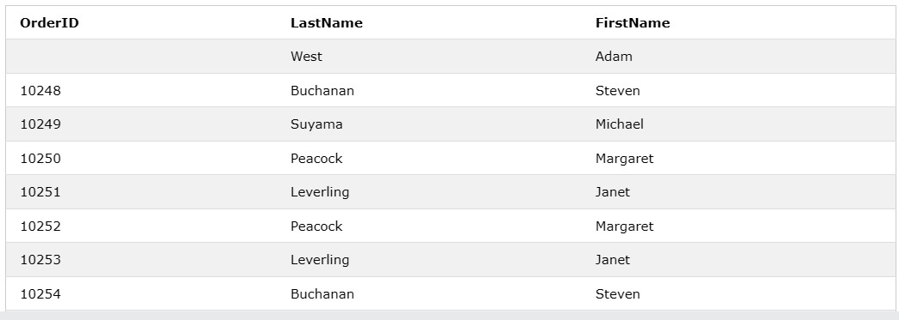

# JOINS
## TYPES OF JOINS
(a) Inner Joins  
The INNER JOIN keyword selects records that have matching values in both tables. 
Example: 
SELECT ProductID, ProductName, CategoryName
FROM Products
INNER JOIN Categories ON Products.CategoryID = Categories.CategoryID 
 

(b) Left Joins 
The LEFT JOIN keyword returns all records from the left table (table1), and the matching records from the right table (table2). The result is 0 records from the right side, if there is no match. 
Example: 
SELECT Customers.CustomerName, Orders.OrderID
FROM Customers
LEFT JOIN Orders
ON Customers.CustomerID=Orders.CustomerID
ORDER BY Customers.CustomerName; 
 
(c) Right Joins 
The RIGHT JOIN keyword returns all records from the right table (table2), and the matching records from the left table (table1). The result is 0 records from the left side, if there is no match. 
Example: 
SELECT Orders.OrderID, Employees.LastName, Employees.FirstName
FROM Orders
RIGHT JOIN Employees
ON Orders.EmployeeID = Employees.EmployeeID
ORDER BY Orders.OrderID; 
 
(d) Full Joins 
The FULL JOIN keyword returns all records when there is a match in left (table1) or right (table2) table records. 
Example: 
SELECT Customers.CustomerName, Orders.OrderID
FROM Customers
FULL OUTER JOIN Orders ON Customers.CustomerID=Orders.CustomerID
ORDER BY Customers.CustomerName; 
 

# ACID PROPERTIES WITH EXAMPLE 
### ACID  IN FULL IS 
A - Atomicity  
C - Consistency 
I - Isolation 
D - Durability 
In computer science, ACID (atomicity, consistency, isolation, durability) is a set of properties of database transactions intended to guarantee data validity despite errors, power failures, and other mishaps. In the context of databases, a sequence of database operations that satisfies the ACID properties (which can be perceived as a single logical operation on the data) is called a transaction.
 

#### LETS HAVE A LOOK OF THEM IN DETAILS

__ATOMICITY__   
By this, we mean that either the entire transaction takes place at once or doesn’t happen at all. There is no midway i.e. transactions do not occur partially. Each transaction is considered as one unit and either runs to completion or is not executed at all. It involves the following two operations. 
— Abort : If a transaction aborts, changes made to the database are not visible. 
— Commit : If a transaction commits, changes made are visible.
Atomicity is also known as the ‘All or nothing rule’. 

___CONSISTENCY___   
This means that integrity constraints must be maintained so that the database is consistent before and after the transaction. It refers to the correctness of a database. Referring to the example above, 
The total amount before and after the transaction must be maintained. 
Total before T occurs = 500 + 200 = 700 . 
Total after T occurs = 400 + 300 = 700 . 
Therefore, the database is consistent . Inconsistency occurs in case T1 completes but T2 fails. As a result, T is incomplete. 

__ISOLATION__  
This property ensures that multiple transactions can occur concurrently without leading to the inconsistency of the database state.  Transactions occur independently without interference.   Changes occurring in a particular transaction will not be visible to any other transaction until that particular change in that transaction is written to memory or has been committed.  This property ensures that the execution of transactions concurrently will result in a state that is equivalent to a state achieved these were executed serially in some order. 

__DURABILITY__  
This property ensures that once the transaction has completed execution, the updates and modifications to the database are stored in and written to disk and they persist even if a system failure occurs.  These updates now become permanent and are stored in non-volatile memory. The effects of the transaction, thus, are never lost. 

SOME IMPORTANT POINTS 
 

# NORMALIZATION 
Normalization is the process of organizing the data in the database. 
Normalization is used to minimize the redundancy from a relation or set of relations. It is also used to eliminate undesirable characteristics like Insertion, Update, and Deletion Anomalies. 
Normalization divides the larger table into smaller and links them using relationships. 
## TYPES OF NORMALIZATION
### FIRST NORMAL FORM(1NF)
First Normal Form (1NF): This is the most basic level of normalization. In 1NF, each table cell should contain only a single value, and each column should have a unique name. The first normal form helps to eliminate duplicate data and simplify queries. 
 
 
### SECOND NORMAL FORM(2NF)
Second Normal Form (2NF): 2NF eliminates redundant data by requiring that each non-key attribute be dependent on the primary key. This means that each column should be directly related to the primary key, and not to other columns. 

### THIRD NORMAL FORM(3NF)
Third Normal Form (3NF): 3NF builds on 2NF by requiring that all non-key attributes are independent of each other. This means that each column should be directly related to the primary key, and not to any other columns in the same table. 

### BOYCE-CODD NORMAL FORM(BCNF)
Boyce-Codd Normal Form (BCNF): BCNF is a stricter form of 3NF that ensures that each determinant in a table is a candidate key. In other words, BCNF ensures that each non-key attribute is dependent only on the candidate key. 
### FOURTH NORMAL FORM(4NF)
Fourth Normal Form (4NF): 4NF is a further refinement of BCNF that ensures that a table does not contain any multi-valued dependencies. 
### FIFTH NORMAL FORM(5NF)
Fifth Normal Form (5NF): 5NF is the highest level of normalization and involves decomposing a table into smaller tables to remove data redundancy and improve data integrity. 

